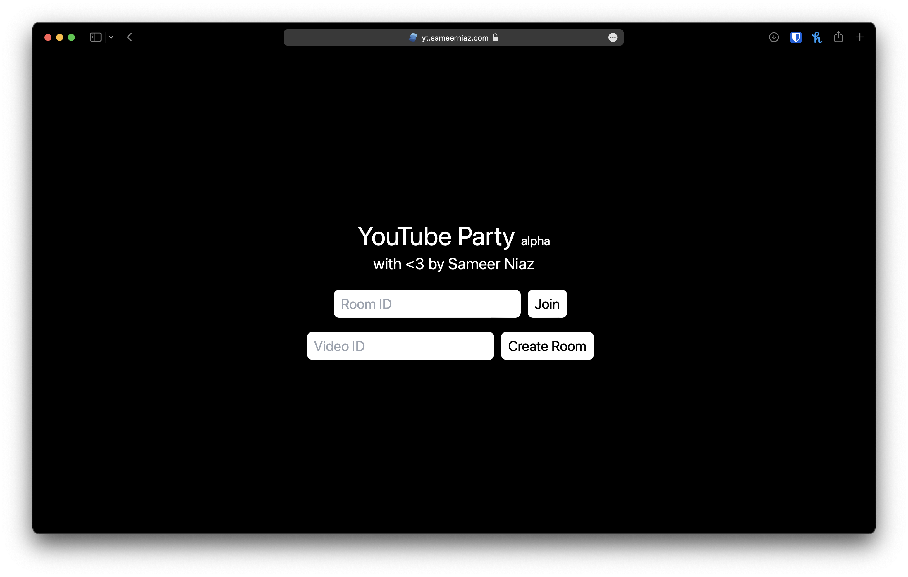
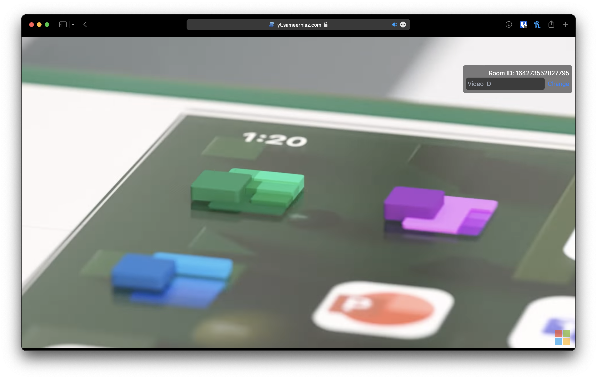

# THE DEPLOYMENT AT YT.SAMEERNIAZ.COM IS OFFLINE.
# YouTube Party

YouTube Party is a real-time web application allowing multiple users to watch YouTube videos together with the playback synchronised across all the users' devices.

## Project Overview

The repository is a monorepo powered by [Yarn workspaces](https://yarnpkg.com/features/workspaces). _(Which means that you need [yarn](https://yarnpkg.com) to develop this project)_ 

All the sub-packages are stored inside the `packages` folder. As of now, the project structure looks like this:

```
- root
  - packages
    - client (Client-side web app)
    - common (Common interfaces and types)
    - server (Server-side web app)
```

The client-side web app is a [SolidJS](https://www.solidjs.com) client built with [Vite](https://vitejs.dev). The server-side web app is a [Fastify](https://www.fastify.io) [Node](https://nodejs.dev) app built with [tsc](https://www.typescriptlang.org/docs/handbook/compiler-options.html). The common package exposes interfaces and types which are used by both the client and the server.

The entire project is built with TypeScript and follows the [Google Typescript Style Guide](https://google.github.io/styleguide/tsguide.html) enforced with the [gts](https://www.npmjs.com/package/gts) npm module.

## Usage



When launching the app, you'll be directed to home page where you'll be prompted to either enter a room ID to join or a video ID to create a room with.



Any actions (Play/Pause/Seek) by party members will be replicated for every other member. The Room ID will be displayed in the overlay UI and can be copied and sent to others. Additionally, there is a field in the overlay UI that can be used to change the current video.

## Development Progress

The high-level architecture of the system is mostly complete. What's left to do is to stomp some bugs and implement QoL and convenience features. Including but not limited to:

- Paste URLs as well as video IDs
- Sharable party links
- Notifications
- Desync check
- Browse videos in-app
- Chat
- Discord integration

An effort to document and refactor some aspects of the codebase is also incoming.

From the perspective of the developer, I am not a 100% sure as to what the endgoal with this app is, but we'll see. :)
